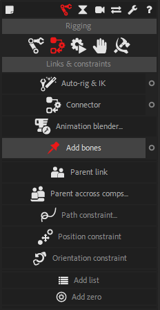
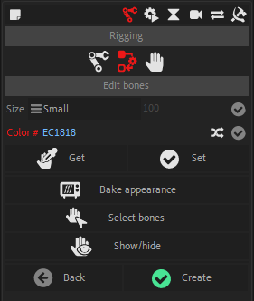
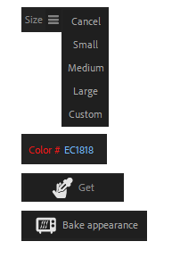

#  Bones

***Bones*** are a very simple yet extremely useful tool. They are layers used to control any spatial property or Bézier shape.

## Creation

1. Select the properties
2. - Click on the _Bones_ button
    - Maintaining the `Alt` key will pick a random color for the new bones
    - Maintaining the `Ctrl` key will ignore the tangents when creating bones on Bézier paths

!!! hint
    You can remove bone layers and recreate them at any time.  
    This is especially useful when rigging Bézier paths where you do not need to rig all the tangents: you can either remove the ones you don't need, or create them later.  
    To create missing tangents on a Bézier path, select the corresponding tangent _in the effects_ of the layer containing the path, and then click the _Bones_ button.

One bone will be created for each spatial property and for each vertex and tangent of Bezier paths.  
Bones can be used to control puppet pins, but also for example the emitter of a particle system, the origin of a lens flare, and any Bezier paths (shapes or masks).

!!! note
    Bones work on Bézier path only in After Effects *CC2018* and newer.

When the property is controlled by a bone, you can rig the bone itself, parent it to other layers (and *Structures* of Duik), etc. which make rigging effects very easy. This is the easiest way to rig a character with the puppet tool of After Effects, or even a way to rig directly the shapes used to draw the character.

## Edit Bones

!!! note
    Available in *Standard* and *Expert* modes only.

In the additionnal panel of the *Bones*, you can adjust their appearance.  
All changes made in this panel will affect all selected *Bones* and the creation of new *Bones*.

- You can change the size of the *Bones*, either automatically, relative to the size of the composition (small, medium and large options), or with an absolute value (custom option).

- You can change the color of the *Bones*: if you click on the colored label, a color picker will be shown, but you can also set your own hexadecimal color code in the text field. A random button will set a random color.

- You can pick the selected *Bone* appearance with the *Get* button, and set the parameters to the selection with the *Set* button.

- The *Bake Appearance* button will remove all expressions used by the *Bones* to set their appearance. This will improve the performance of the rig, but you will not be able to change the appearance afterwards.
