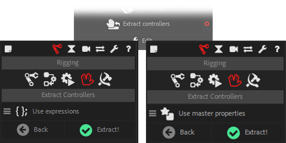
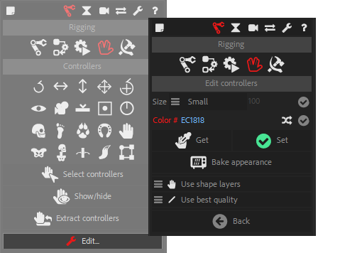

[TOC]

# Controller Tools

  
This is the Controllers panel in *Normal* mode.

##  Select Controllers

Click the ***Select controllers*** button to select all the Controllers in the composition.

##  Show / Hide Controllers

Shows or hides all (or selected) ***Controllers*** found in the composition.

If there is no layer selected, this will show of hide all *Controllers* in the composition, or else it will use the layer selection.

##  Extract Controllers

In most cases, it is easier to have rigs (for characters or other items) in their own precompositions, but this is not the most handy way to animate, especially when you have several characters in the same shot or if you need to see the background.

To avoid assembling all the rigs and the background in the same composition, you can keep the rigs in a precomposition and *Extract* the controllers.
This way, all the controllers are available in the same main composition, with the background if you wish, but the rigs stay precomposed. This is especially useful when there are a lot of layers for the rigs, and if you want to render proxies for character animations in order to improve performance when compositing the shot.

- Just select a precomposition layer containing a rig, and click the ***Extract Controllers*** button to copy the controllers to the current composition and be able to animate outside of the rigged precomposition.

###  Extract controllers options

You can choose to extract controllers using expressions or *Master Properties*.

!!! note
    Master Properties are available in After Effects *CC2018* and above only.

- When using expressions, the project can still be saved to a previous version of After Effects, and the rig will be more robust, more stable.

- When using *Master Properties*, you will be able to have different instances of the rigged composition, in example to have different animations **of the same rig**. But *Master Properties* are not fully scriptable in current versions of After Effects, and the rig can break if the composition is not correctly duplicated.

!!! hint
    *Master Properties* can be very powerful. If you want to use them safely in this case, follow these steps:

    1. Rig the character as you'd do in any case.
    2. Put the rigged composition into another composition, let's call this one the "Animation Comp". The rigged composition is now a precomposition inside "Animation Comp".
    3. Select this rigged precomposition, and extract controllers with Duik, using Master Properties.
    4. "Animation Comp" can now be duplicated; each new copy can have its own animation, and this way you can have as many animations as you wish with a single rig.

##  Tag Controllers

Sometimes, you may want to use custom layers as controllers (for example, if you designed it yourself in Photoshop, or want to use any existing layer as a controller).  
In this case, you can use this _tag_ tool on these layers so Duik can recognise them as controllers when using other controller tools, like [*Extract controllers*](#extract-controllers).

Duik will add a new layer marker on the first frame of the layer, named *Controller*.

##  Edit Controllers

!!! hint
    Available in _Standard_ and _Expert_ modes only.

In the edition panel, you can adjust the appearance of the Controllers (Normal and Expert mode).

All changes made in this panel will affect all selected Controllers and the creation of all other Controllers.

- You can change the size of the Controllers, either automatically, relatively to the size of the composition (small, medium and large options), or with an absolute value (custom option).

- You can change the color of the Controllers: if you click on the colored label, a color picker will be shown, but you can also set your own hexadecimal color code in the text field. A random button will set a random color.

- You can pick the selected Controllers appearance with the "Get" button, and set the parameters to the selection with the "Set" button.

- The "Bake Appearance" button will remove all expressions used by the Controllers to set its appearance. This will improve the performance of the rig, but you will not be able to change the appearance afterwards.

- You can choose to use shape layers (with icons and visual feedback) or simpler null objects to create controllers by default when using the rigging tools.

- You can choose to use _Draft mode_ or _Best quality_ to render the controller layers by default (this can be changed at any time in After Effects). Setting _Draft mode_ can greatly improve performance by disabling anti-aliasing on these layers.
