[TOC]

# Create structures

There are several ways to create _Structures_ with Duik, depending on what you need. As all the other tools in Duik Bassel, **the _Struture_ creation tools try to be smart, and change their behaviour depending on the context** (i.e. the current selection in the current composition).

You can create either complete characters (e.g. Homonoïds, etc.), single limbs (e.g. Arms, Legs, etc.), or custom structures. **Except for complete characters**, the way the _Structures_ are created will change depending on the selection.

Complete characters are always created in the center of the composition, and nothing is linked to the new _Structure_, you'll have to create the links between the artwork and the *Structures* by yourself later.

Without any selection in the composition, predefined limbs and custom _Structures_ will also be created in the center of the composition, but with a selection, they will be moved to the selected properties or layers, and you have the option to automatically parent or link them back to the newly created [*Structures*](structure-tools.md#edit-structures).

**If Bétzier path properties (i.e. mask path or shape path) are selected, one _Structure_ will be created for each path**, with one _Structure element_ for each vertex of the path.  
Vertex and tangents will both be linked to the corresponding _Structure elements_, but there is no individual control for tangents. You can create them later if you need with the [_Bones_](bones.md) tool.

!!! note
    As _Structures_ **can** be created on a bezier path with any version of After Effects, paths can be linked back to the _Structures_ only on After Effects CC2018 and newer.

**If puppet pins are selected, one *Structure* will be created for each layer**, with one _Structure element_ for each puppet pin. The order of the elements of the _Structure_ depends on the order of the pins in the layer stack. You can re-order them before creating the _Structure_ to adjust how the _Structure_ is created and optionally how the pin is linked to it.  

**If layers are selected, without any other property, one _Structure_ will be created**. Each _Structure element_ will be moved to a corresponding layer, and the layer can optionally be parented to it.

!!! note
    If there are selected layers with their anchor points at the same location in the composition, the _Structure_ will not use the layers' position, and layers will not be parented, to avoid weird issues happening when layers share the same anchor point in the same _Structure_ chain.

!!! hint
    You can separately activate the automatic linking of layers, pins and paths to the _Structure elements_ in the [edition panel](structure-tools.md#edit-structures) of the _Structures_.  
    Holding the `Ctrl` key when creating *Structures* will enable you to temporarily disable or enable this automatic linking depending on the preferences you set.

!!! warning
    Never duplicate nor copy and paste _Structures_ in After Effects, always create new _Structures_ or use the [_Duplicate_](structure-tools.md#duplicate-structures) button in the _Structures_ panel of Duik.

    Internal unique identifiers are associated with the _Structures_, which won't be updated when you copy or duplicate the _Structures_ in After Effects. The [_Auto-rig_](autorig.md) and other rigging tools in Duik need these identifiers to work correctly and may fail if they are not set properly. The [_Duplicate_](structure-tools.md#duplicate-structures) tool does this.

##  Hominoid

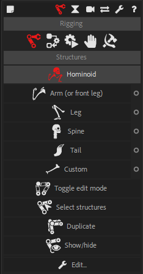

This tool will create *[Structures](structures.md)* for a complete hominoid with a spine, two legs and two arms, using the settings of the individual limbs set in the *[Structures](structures.md)* panel.

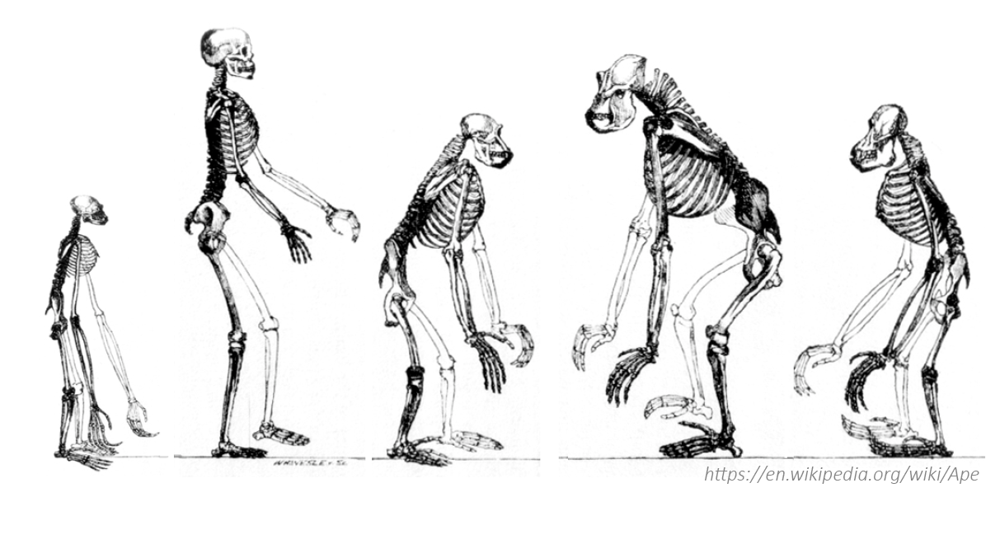

!!! note
    [Hominoids](https://en.wikipedia.org/wiki/Ape) (Hominoidea) are a branch of tailless anthropoid primates native to Africa and Southeast Asia.
    They are distinguished from other primates by a wider degree of freedom of motion at the shoulder joint.
    There are two extant branches of the superfamily Hominoidea: the gibbons, or lesser apes; and the hominids, or great apes (orangutans, gorillas, chimpanzees, humans).

!!! hint
    `Alt + Click` on the button for a demo of what Duik can do!

##   Types of walking animals

The rig, and the animation, of the animal you're working on depends a lot on how it walks. There are three main ways of walking among vertebrates.

Type | Description | Examples | Notes
-----|-------------|----------|------
Plantigrade | Animals which put the whole foot on the ground, with the heel touching the ground when they walk. | Primates, bears, rabbits... | The ones nearly equal to humans.
Digitigrade | Animals which walk on their fingers. | Dogs and all canines, cats and other felines, dinosaurs, walking birds... | The friends of humans.
Ungulate | Animals which walk on the tip of their fingers, who usually have hoofs. | Horses, cattle, girafes, pigs, deers, camels, hippopotamuses... | The ones humans eat

For each limb you can create with Duik, you have to choose the type of walking animal it is (for arms and legs), and which parts of the limbs must be created.

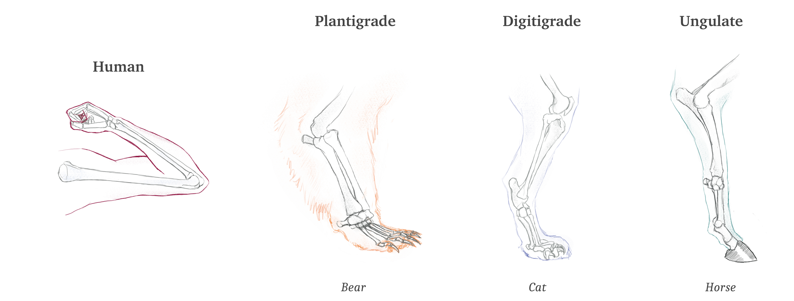

##  Arm

Creates a Structure for the arm or the front leg of a quadruped.

Click the ○ button to adjust the settings for the arm.

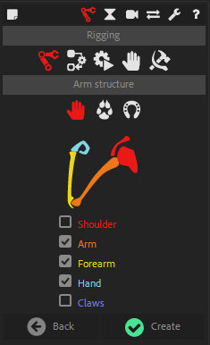

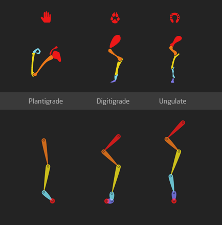

You can check which part of the limb is present on your character. The autorig will adapt to every configuration, but using all of them (except for claws when rigging humans) can ensure a nice rig and a more realistic animation.

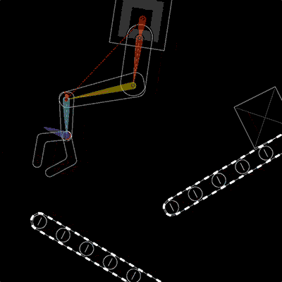  
_Animation by [Jissse](http://jissse.com)_  

##  Leg

Creates a *Structure* for the (rear) leg of a biped or a quadruped.

Click the ○ button to adjust the settings for the leg.

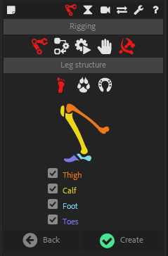

The autorig will adapt to every configuration, but using all of them can ensure a nice rig and a more realistic animation (with a proper foot roll).

##  Spine

Creates a *Structure* for the spine of any vertebrate.

Click the ○ button to adjust the settings for the spine.

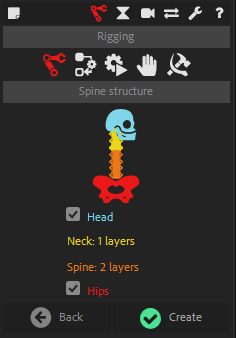

You can check which part of the spine is present on your character.
You can divide the spine and the neck in as many layers as you want (or none).
The autorig will adapt to every configuration.

##  Tail

Create a *Structure* for the tail of any animal.

Click the ○ button to adjust the settings for the tail.

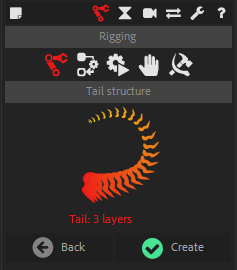

You can divide the tail in as many layers as you want.
The autorig will adapt to every configuration.

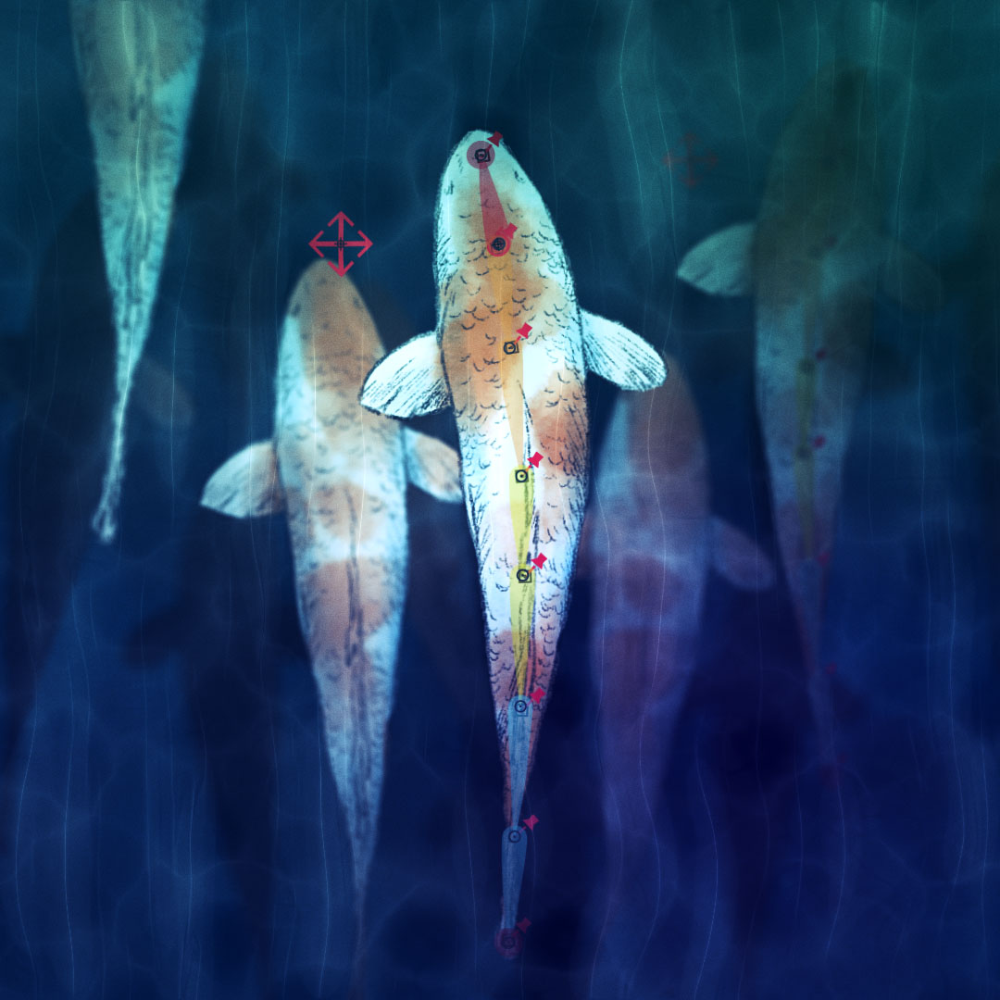  
_Illustration by [Jissse](http://jissse.com)_  
With *Tails*, you can even rig fishes very easily.

!!! tip
    In the Autorig options, you can choose between rigging tails using [*Bezier IK*](autorig.md#bezier-ik-multi-layer-spine-tails) controls or [*FK* (with automatic follow through and overlap)](autorig.md#fk-with-follow-through-overlap-and-drag-tails) controls. The latter achieves a natural motion more easily, but *IK* could be needed in some cases, like if the tail interacts with anything else.

##   Custom Structure

Creates a standard, custom *Structure*.

Click the ○ button to adjust the settings for the custome structure.

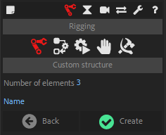

You can set the number of elements in the Structure, and choose a name for it.

!!! hint
    Hold the `Alt` button on your keyboard to assign a new random color to the _Structure_.
