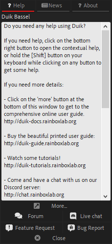
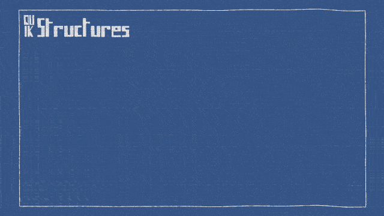
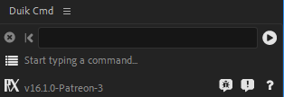
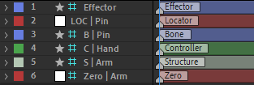

[TOC]

# First Look

## Help

If you need help, click on the bottom right button in Duik to open the [*contextual help*](contextual-help.md), or hold the `Shift` button on your keyboard while clicking on any button to get some [*help*](contextual-help.md).

Take a look at the [frequently asked questions](duik-faq.md) if you don't find a solution to your issue in this user guide.

If you're still stuck, come and ask for help on [the official forum](https://forum.rainboxprod.coop) or on [our live chat server](http://chat.rainboxprod.coop)!

## How Duik works

Duik is a script. This means all it does is automating things. It does nothing you could not do by yourself in *After Effects* (if you had time to do some very tedious work).

This has two important meanings:  

1. A project rigged or animated with Duik can be opened with any installation of *After Effects* even if Duik is not installed.
2. Duik uses only tools and techniques already existing in *After Effects*.

!!! note
    This is not 100% true as the latest versions of Duik include *ffmpeg*, a free media encoder, used to transcode audio when exporting to *Audition*. In the future, it is possible that Duik includes more third-party tools like that for specific features.

## The User Interface of Duik

The goal of a tool like Duik is to make the life of animators (and riggers) easier. **The priority was to make Duik as easy to learn as possible**, while keeping it **very quick to use**. The other important goal was to make the interface as small as possible, so it won’t take much space in the *After Effects* interface; we think it’s very important to be able to focus on the timeline and the viewport of the application, without any other tools interfering when you’re animating.

To achieve this, we’ve made Duik smarter. **Almost all tools can be used in a single click**, without any prior configuration steps, **letting Duik make the best choice** depending on what you’re doing, what are the selected layers, etc.

Most of the rigging process can be reduced to two clicks in *Duik Bassel*!

1. First click: create a complete humanoïd *Structure*.  
2. Second click: *Auto-rig* the whole *Structure*.  
And this is done without any configuration step or other click in Duik.
3. If you feel this is not enough, a nice procedural walk cycle is just another click away…

### User Interface (UI)

As any modern script in *After Effects*, Duik has the form of a panel which can be docked with other native *After Effects* panels and third party tools (provided it was [correctly installed](install-duik.md) and launched from the *Window* menu of *After Effects*).

The User Interface has been designed with these main ideas in mind:

1. **Keep it close to the form of the user interface of** ***After Effects***  
Using controls similar to the native controls of *After Effects* helps the user get started quickier. But it was not possible, for specific features and for performance and stability reasons, to make everything exactly the same as in *After Effects* and controls differ a bit. The idea is that Duik must not stand out too much when docked with other *After Effects* panels.  
2. **Do not use popups, windows and dialogs**  
With very rare exceptions, everything Duik needs to display will be displayed in its main panel (with the exception of the *Help Panel*, which needs to be visible at any time), it won't use dialogs and other windows, so you know where to find information, and you're not distracted by popups. Also, there are no blocking windows (what's called *Modal Dialogs*), to keep an agile workflow.
3. **Keep the UI as small as possible**  
What is important when working with graphics is the viewport. Duik is as small as it can be so it won't interfere with your workspace.

### Categorization

Duik is a comprehensive tool set for rigging and animation. This means there are a **lot** of tools available, but they are categorized in some useful panels, depending on what you're doing (animating, rigging, using cameras,etc.)

When launched, Duik displays a welcome screen showing these categories.

!!! tip
    This welcome screen can be [de-activated](settings.md) to get to the latest used panel as soon as Duik is launched, but this greatly increases its launch time.

Later, these categories are always available on the top bar.

Each panel can be displayed by clicking on one of these top buttons.  
The first button, on the left, opens a very simple yet useful [***notes editor***](notes-editor.md).  

The other buttons display the available panels:

- [***Rigging***](rigging.md)
- [***Animation***](animation.md)
- [***Camera***](camera.md)
- [***Import and Export tools***](i-o.md)

On the bottom bar, you'll find some other useful buttons:

The ***RX*** icon opens the [*Rainbox Lab.*](https://rainboxlab.org) website where you can find useful information about Duik and other tools.

You can also read the version of Duik you're using, and the two buttons at the right open two other panels:

- [***Settings***](settings.md)
- [***Help***](contextual-help.md)

#### Individual panels

As Duik is made of a lot of panels and sub-panels, depending on your workflow, sometimes you may lose time constantly switching from one panel to another, or just finding a tool you're not used to. As there are as many workflows as users, to address this issue Duik now comes with a lot of optional, individual and [dockable panels](install-duik.md), which you can use as stand-alone scripts. This is a great way to organize your workspace and keep several different panels of Duik opened at once.

When these stand-alone panels are installed, you can also quickly open them by `Alt + Click` on the tab buttons in the Duik Bassel main panel.

!!! tip
    Don't forget the *stacked* mode for After Effects panels, which can be nice to keep all your Duik panels at hand.

Among these individual panels, you'll also find a special one, the [Duik Cmd](duik-cmd.md) panel...

### User Experience (UX)

For every feature in Duik, the goal is to have a consistent workflow, the fastest possible, the easiest possible.

Most of the tools work this way:

1. Select layers, properties or keyframes in the timeline of *After Effects*  
2. a. Click on the button of the tool you need  
    b. For some tools, a secondary panel is displayed to ask for some additional needed information
3. Watch Duik work  
(Actually, you won't, as for performance reasons most of the work remains hidden from the user, sorry ;) )

To be able to work in a single click, the tools need to be smart enough to take some decisions depending on what you're doing.  
Of course, Duik does not want you to be or feel limited to what you can do. Although most of the tools work in a single click, some of them are accompanied with a little "circle" button. This means there are options you can change for the future use of the tool, which you can access by clicking on the circle.

Duik can also be personalized through some [settings](settings.md) so you can adapt it to your liking.

### Rookie, standard, expert or god mode

As Duik includes a lot of tools, it has been decided to filter them and adapt the user interface depending on the level of the user, to make it easier for beginners, while quicker and more complete to the most advanced users.

There are four different modes for the user interface, depending on your level:

- ***Rookie*** is the simplest one, recommended if this is the first time you use Duik Bassel. Only the most used and simplest tools are available, and the user interface is thought to be as easy to use as possible.
- ***Standard*** has nearly all the tools available, in a nice and easy-to-use user interface.
- ***Expert*** may be a bit more complex to use as there are less texts to explain what do the buttons do. Some very specific tools (for scripters and expressioners) are only available in this mode.
- ***God*** is the smallest mode, made nearly only of icons. This is perfect if you know Duik well and you don't want the panel to take too much room in your workspace.

## What Duik does in *After Effects*

The *After Effects* features mainly used by Duik are:

- Expressions and parenting
- Layer creation
- Custom (Pseudo) effect

### Expressions

(Almost) Every time Duik adds an expression to a property, the expression begins with a comment to let you know what the expression is and does.

### Layers

Although Duik uses existing layer types in *After Effects* (mostly shape layers and null objects), the layers it creates have a specific use and can be considered as new layer types.  
Layers created by Duik have a marker at their beginning, showing how Duik uses them (their "Duik Type"), and containing important data that Duik needs to work with. **Do not remove these markers** (but you can move them away, even before the beginning of the comp to hide them, if you find them annoying).

The main types defined by Duik are: 

- [*Controllers*](controllers.md) can be shape layers or null objects (depending on a setting in the [*controller editor*](controller-tools.md) panel). They are used to manipulate and animate compositions rigged by Duik.
- [*Structures*](structures.md) are shape layers used to actually rig characters and props. They should not be manipulated by the animator and can be hidden as soon as the rigging process is finished.
- [*Bones*](bones.md) are shape layers which control spatial properties of effects (like puppet pins) or Bézier shapes and masks. They are usually parented to *Structures* to be rigged and animated, but sometimes can be animated themselves just to control the position of an effect, or parent it to anything else.
- [*Locators*](parent-accross-compositions.md) are null objects used to expose the absolute transformations of another layer in a composition, and to create links between layers and compositions.
- (Spatial) [*Effectors*](effector.md) are a special type of controller used to drive properties and motion depending on spatial coordinates.
- [*Zeroes*](zero.md) are null objects used to zero out the coordinates of other layers.

There are other types of layers used by Duik, which are more specific to some tools.

### Custom effects

Duik uses a lot of custom effects, which are more generally called *Pseudo-Effects* in the After Effects community, although this is not an official feature in After Effects.  
*Pseudo-Effects* are a hack to create nicer controls for expressions than the native After Effects "Expression controls" effects, but they do nothing more than controlling expressions too. It's a bit complicated to create them by hand in After Effects, but there are useful scripts which do this very easily like [*Pseudo Effect Maker*](https://aescripts.com/pseudo-effect-maker/).  
Duik makes a great use of them to create nice user-friendly controls in the effects of the controllers. Always have a look in the *Effects* panel of After Effects when you rig something with Duik!

### Removing Duik "effects"

When you need to remove something made by Duik, you have to understand that Duik did nothing more than creating layers, expressions and pseudo-effects.  
Each time you need to remove something, you just have to remove the expressions and pseudo effects created by Duik, and maybe the layers too.  
This can sometimes be a bit tedious, but future versions of Duik will include tools to automate this process.
