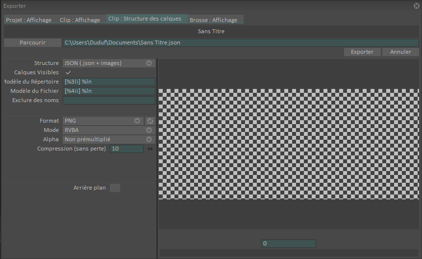

[TOC]
# IMPORT

##  Animation

You can re-import After Effects animations previously [exported](../Export/#Animation) with Duik.

When importing animation, Duik will try to load the animations onto the layers with the same name and index which are selected in the active composition (or in all layers if none are selected).  
If after this there are still some animations which were not imported (i.e. if Duik do not find any correspondance for their name & index in the composition), Duik will ask you on which layer you want to set them. Set to *None* to ignore some of them, or click the *Cancel* button to ignore them all.

###  Animation options

- **All properties/Only keyframes**: If "All properties" is selected, the value of properties without animation will be updated too, if the imported animation has a value for them. Setting this option to "Only keyframes" allows to ignore all imported properties without animation (i.e. simple values without keyframes).

- You can filter the type of property you want to import: Position, Rotation, Scale, Opacity, Shapes/Masks paths, Effects properties, or all properties (no filter).

- **Offset/Absolute**: you can choose to either load the values are they are in the imported animation ("Absolute" setting) or to offset the current values ("Offset").

- **Replace existing keyframes**: check this box to remove all previous animations from the properties which are imported.

##  Rig

!!! note
    Still in development

Imports a rig previously exported in a JSON format (XML may be added too).

##  Clip from TVPaint

!!! hint
    Since its 11th version, _TVPaint_ comes with a tool to import clips in _After Effects_, but the importer in Duik works a bit differently:

    - the animation exposure can optionally be set directly on the frames instead of using time remapping,  
    - there is one level of precomposition less, so the resulting compositions are a bit cleaner,  
    - the camera is not imported with the clip, as it can be imported using the better [_TVPaint Camera_](import-tvpaint-camera.md) import tool, with more options and precision, and which can be set on a [_2D camera_](camera-2d.md) created by Duik.
    - The Duik importer handles more blending modes than the one provided with TVPaint.

### TVPaint 11 and newer

1. Export the clip to JSON (using the Layers structure tab of the export panel).

    

2. Click on the TVPaint button in Duik, and select the JSON file.

### Previous versions of TVPaint

1. Export the clip using the "*MJ_AFX_Export*" script for TVPaint, which is provided with Duik.  
The script creates a folder containing all needed frames in the clip, and a "*clipInfo.txt*" file.

2. When importing the clip with Duik, just select this text file, everything is automated.

##  Krita Animation

Duik can import traditional animations made with [Krita](http://krita.org), without needing to export frame sequences or video.

Duik will keep all layers and the animation exposure/timeline from ***Krita***.

1. Export the animation from *Krita* as a *CSV* file. Krita will also create a subfolder with the exported layers and frames.
2. Click on the *Krita* button in Duik.

Duik imports all the layers and frames from Krita and then creates a composition corresponding to the Krita project with the same layers and parameters.

##  Wonderunit Storyboarder

Duik imports Storyboard files from [Wonderunit Storyboarder](https://wonderunit.com/storyboarder/), and creates a composition for an animatic, keeping the layers, shots, notes and sound from Storyboarder.

Duik also adds some text layers with shot names and useful timecodes.

- You can choose to either overlay the notes or display them below the frame.
- You can precompose the shots or have all layers in the same composition.
