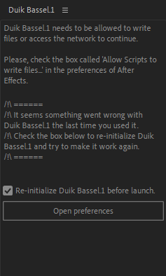

[TOC]

# Supported versions of After Effects 

Duik has been tested and is working with all versions of After Effects since *CC2018*. That means it works correctly on:
***CC2018 (15), CC2019 (16)*** and upcoming versions.

It is also known to be working decently on *CS6 (11), CC (12), CC2014 (13), CC2015 (13.5), CC2017 (14)*, but you can't be sure, and Duik does not officially support these versions.

!!! note
    CS6 has a lot of issues with the *Script Panels* like the ones used by Duik. Duik will work on CS6, but you may have to close and re-open it often to fix the issues you may have with the UI…

!!! warning
    All versions before CS6 can not run Duik, sorry! It’s time to update…

# Installation

## **1 - Download** Duik from the [official website](https://rainboxprod.coop/en/tools/duik/).

## **2 - Unzip** the files you have downloaded.

You'll find several folders and files.

- *README.txt* contains a lot of information to help you get started with Duik.
- The *Help* folder contains this help pages. Double click on the file *index.html* to open it.
- The *Tools* folder contains some tools for other third-party software, like a script to export *TVPaint* animations.
- The *ScriptUI Panels* folder contains the actual *Duik Bassel* script you need to install.
- The *Optionnal Panels* folder contains [optionnal individual panels](first-look-at-duik.md#individual-panels) to use with Duik. You can choose to install any of them or not at all.

## **3 -** There are several ways to install Duik very easily:  

### a. Copy the files

Copy all the files from the *ScriptUI Panels* folder to:

- Windows: `C:\Program Files\Adobe\Adobe After Effects CC\Support Files\Scripts\ScriptUI Panels\`  
- Mac OS: `/Applications/Adobe After Effects CC/Scripts/ScriptUI Panels`

You can also copy the [optionnal individual panels](first-look-at-duik.md#individual-panels) of your choice from the *Optionnal Panels* to the same folders.

You may need administrator privileges to install Duik this way. If you don't have them, see the other ways below.

!!! Warning
    With the other installation methods, some features using third party tools, like transcoding sound when exporting to Adobe Audition, may not work correctly.

### b. Shortcut for ***After Effects CC2018*** and more recent

- Open After Effects  
- *Windows*: Holding the `Alt` and `Shift` keys, drag and drop the file `Duik Bassel.jsx` onto the Project panel.  
- *Mac OS*: Holding the `Options` and `Shift` keys, drag and drop the file `Duik Bassel.jsx` onto the Project panel.  

### c. Using the menu for ***After Effects CC2019*** and more recent

- Open After Effects  
- Use the `File/Scritps/Install ScriptUI Panel...` menu to select and install `Duik Bassel.jsx`.  

## **4 - Restart** After Effects and Duik will be available in the "Window" menu.

# Without installation 

You'll always be able to run Duik without even installing it. This is a good way to use it if you do not have administrator privileges on an older version of *After Effects*.

- Unzip all the files in any folder.  
- Launch After Effects, and start Duik via the `File/Scripts/Run script file...` menu.

# Fix / Uninstall Duik

If for any reason Duik won't start anymore (this happens sometimes when the settings file gets corrupted for example, especially on *Mac OS*...), you can try to fix it with this simple procedure:

- In the preferences of After Effects, disable the option "*Allow scripts to write files and access network*" which is either in the *General* section or the *Scripts and Expressions* section, depending on the version of After Effects.
- Start the main panel of Duik from the *Window* menu.

- A checkbox should be available allowing you to re-initialize Duik. Check it, then click on the button to open the preferences and re-enable the *Allow scripts to write files...* option.
- A few alerts should be shown, as Duik wipes its own files to be re-initialized ;)

If you want to remove Duik, and be sure to remove all the files it left behind, you'll have to remove its panels by yourself from the *ScriptUI Panels* and then run the *Uninstall Duik.jsx* script provided with Duik, throught the *File/Scripts/Run Script...* menu in After Effects.