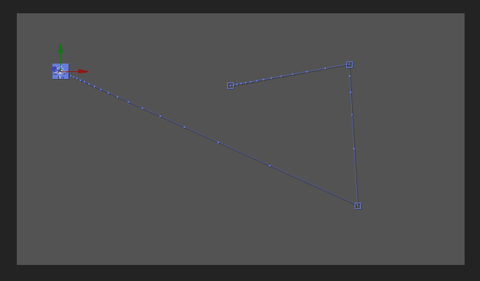
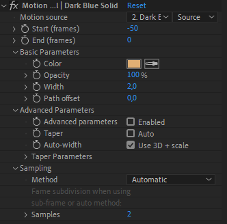
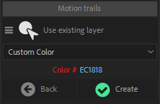

[TOC]

#  Motion Trail

!!! note
    Available in After Effects *CC2018* and above only.

The ***Motion Trail*** tool draws the trajectory of any layer in a shape layer, and can make trails behind (or in front of) them.

## Setup

1. Select the layer(s)
2. Click on the *Motion Trail* button

A *Motion Trail* layer is added to the comp. It is a shape layer used to draw the trails. An effect is added on this layer for each motion trail created.

!!! hint
    As the motion trail is contained in a shape layer, it is easy to change it's appearance and use it as you wish! You can add and modify everything in the content of the Motion Trail layer.
    
!!! note
    To duplicate a motion trail, you can't just duplicate the effect; the content of the shape layer needs to be adjusted too.  
    There are two ways to add multiple motion trails for the same layer:  
    - Duplicate the motion trail layer instead of just the effect.
    - Use the motion trail button in Duik to re-create a new motion trail for the same layer.

## Effect

Use the effects of the *Motion Trail* layer to adjust all the trails.

- The *Motion source* is the layer used to draw the trail.

- You can set the start and end (in frames relative to the current time) to adjust the length of the trail.
  Note: long trails can have a big impact on the performance.

### Basic Parameters

In the basic section, you can change and animate basic appearance settings. Keep in mind that *Motion trails* are standard shape layers and you can do much more with them by modifying the content yourself.

### Advanced Parameters

When you activate the advanced parameters, the width of the trail can be dynamic and you can add a taper. But be careful as this mode requires a lot of computation and has a bad impact on performance.

When advanced parameters are enabled, you can add an automatic taper to the trail (which shape can be adjusted in the *Taper Parameters* section).

The *Auto-width* option will adjust the width of the trail according to the scale and 3D position of the layer, effectively creating a 3D trail (in a shape layer which is still 2D).

!!! note
    The trail with advanced parameters turned on uses a filled shape instead of a stroke, so it is not possible to have dashes. Turning of the advanced parameters will hide the *fill* will allow you to adjust the *stroke* and add dashes.

### Sampling

By default, the motion is sampled each frame of the composition. If the movement is very fast, you might want more samples for a smoother trail. In this case, you can switch to Automatic sampling which will try to adjust depending on the velocity and choose the best sampling while trying to keep better performance, or sub-frame sampling which is the calculation-intensive way to sample the motion. In Automatic and sub-frame sampling you can adjust the number of samples, which directly impacts the quality of the trail but can have a big impact on performance, too.

## Additional panel

In the additional panel, you can choose to create a new layer when you create new motion trails, or to add them all on the existing layer if any.
You can also set the color of new motion trails.
