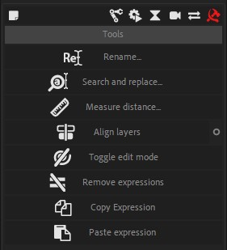
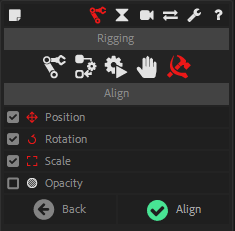

# Tools

A few tools which can be useful in the rigging process are available.

[TOC]

##  Rename

With the *Rename* tool you can rename as many layers, puppet pins or project items at once as you wish.

This tool is able to update the expressions after having renamed the elements, if you need it. Disabling the option if you don't need it may improve performance a little bit.

##  Search and Replace

You can *Search and Replace* text in layer names, project item names, expressions or source texts of text layers.

##  Measure distance

When two layers are selected, click on the *Measure Distance* button to measure the distance between their anchor points, in pixels.

##  Align Layers

Select some layers to align them together. Layers will be aligned on the latest selected one.

In the additional panel you can choose to align the layers in *position*, *rotation*, *scale* or even *opacity*.

!!! caution
    This tool works well even if layers are parented to other layers, but if there is non-uniform scale on the parents, they can not be properly aligned in scale, as the induced deformation can not be reproduced using only transformations.

##  Toggle edit mode

Un-parents and re-parents the children of a layer to be able to adjust its transformations without affecting them.

## Expression links tools

!!! hint
    Available in _Standard_, _Expert_ and _god_ modes only. 

A few tools to help manage links inside expressions. For example, you can automatically switch between using `thisComp` or `comp("Name")`.

##  Remove expressions

!!! hint
    Available in _Standard_, _Expert_ and _god_ modes only. 

Select some properties with expressions to remove the expression, but keeping their current *post-expression value* instead of the *pre-expression value* like After Effects does.

Holding [Alt] when clicking on the button will keep the *pre-expression* value (just removing the expression without actually changing anything else).

##  Copy / Paste expressions

!!! hint
    Available in _Standard_, _Expert_ and _god_ modes only. 

This very simple tool will copy an expression from a selected property, and then allows you to paste it on several properties at once, without changing their pre-expression values or keyframes.

##  Export Animation

!!! hint
    Available in _Standard_, _Expert_ and _god_ modes only.

You can export After Effects animations with Duik.

1. Select the layers and/or the keyframes to export
2. Click on the *Export Animation* button

The exported data will be stored in a standard and open JSON (text) file.
You can then re-import the animation to other projects/layers in After Effects, or use it in another software.

!!! tip
    It can be useful in After Effects to store the motion data appart for the After Effects project file, to make it quicker and easier to re-use it or even build an animation library for any kind of animations.

!!! hint
    This JSON data can be pretty easily parsed in any other software with only a little development work. It can be a game engine, another animation software, conversion to a web animation format... It's up to you, if you know a little bit about writing scripts.  
    The format is not yet documented, but easy to understand just by reading the file. It is very close to how animations are stored in After Effects.

##  Import Animation

!!! hint
    Available in _Standard_, _Expert_ and _god_ modes only.

You can re-import After Effects animations previously exported with Duik.

When importing animation, Duik will try to load the animations onto the layers with the same name and index which are selected in the active composition (or in all layers if none are selected).  
If after this there are still some animations which were not imported (i.e. if Duik do not find any correspondance for their name & index in the composition), Duik will ask you on which layer you want to set them. Set to *None* to ignore some of them, or click the *Cancel* button to ignore them all.

###  Import Animation options

- **All properties/Only keyframes**: If "All properties" is selected, the value of properties without animation will be updated too, if the imported animation has a value for them. Setting this option to "Only keyframes" allows to ignore all imported properties without animation (i.e. simple values without keyframes).

- You can filter the type of property you want to import: Position, Rotation, Scale, Opacity, Shapes/Masks paths, Effects properties, or all properties (no filter).

- **Offset/Absolute**: you can choose to either load the values are they are in the imported animation ("Absolute" setting) or to offset the current values ("Offset").

- **Replace existing keyframes**: check this box to remove all previous animations from the properties which are imported.

##  Get property info

!!! hint
    Available in _Expert_ and _god_ mode only.  

Select one property and click on this button to get some useful information about the property, like its index, its match name, its path in expressions...

##  Scriptify expression

!!! hint
    Available in _Expert_ mode only.  

Select a property with an expression to convert this expression to a string easy to include in a .jsx script. You can just copy and paste the generated script into your own script to quickly use the expression.
