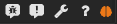
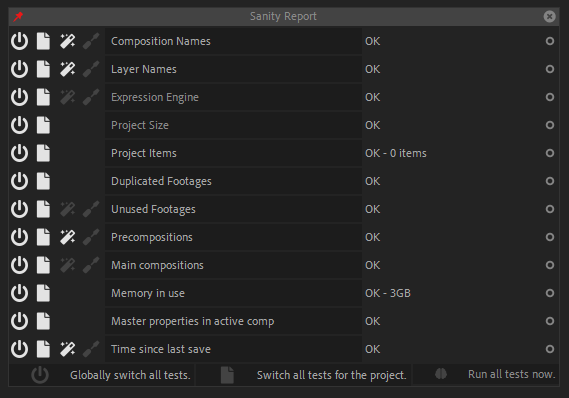

# Sanity Tests

Duik displays the project Sanity level through the bottom right *brain* icon. It runs a few tests regularly and changes the color of the icon depending on the results.

-  OK
-  Info
-  Warning
-  Bad
-  Critical
-  Fatal

Click on the icon to display the detailed results of the tests. You can enable and disable the tests globally or only for the current project, and (auto)fix issues for some specific tests.

Read the [***DuSan - Duduf Sanity Report for After Effects***](http://dusan-docs.rainboxlab.org) for more information.
