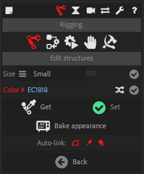

[TOC]

# Structure Tools

!!! warning
    Never duplicate nor copy and paste _Structures_ in After Effects, always create new _Structures_ or use the [_Duplicate_](structure-tools.md#duplicate-structures) button in the _Structures_ panel of Duik.

    Internal unique identifiers are associated with the _Structures_, which won't be updated when you copy or duplicate the _Structures_ in After Effects. The [_Auto-rig_](autorig.md) and other rigging tools in Duik need these identifiers to work correctly and may fail if they are not set properly. The [_Duplicate_](structure-tools.md#duplicate-structures) tool does this.

 

##  Toggle Edit Mode

*Toggle edit mode* (*Standard* and *Expert* mode) disables the parenting of all the children of the selected *Structure element* to be able to move it without affecting the other elements.

1. Select some *Structure elements*
2. Click the ***Toggle edit mode*** button
3. You can now edit the *Structure elements*, moving, rotating and scaling them as you wish
4. Once you have moved the Structure as you wish, do not forget to click the *Toggle edit mode* button again (with the elements selected) to re-parent the children.

##  Select Structures

Click the ***Select structures*** button to select all the Structures in the composition.

##  Duplicate Structures

Click the ***Duplicate structures*** button to duplicate them. On the contrary of the *duplicate* function of After Effects, the resulting *Structure* will be correctly parented, and the layers will be grouped together in the stack.

!!! note
    When using this tool to duplicate *Structures*, Duik will adjust some internal stuff to make sure the Autorig can differentiate the duplicated one from the original one.

!!! warning
    You should always use this button to duplicate *Structures*, and **not** duplicate with After Effects (`Ctrl+D`), or else the *Auto-rig* will consider the duplicated structure to be the same as the original one and will do weird stuff with it...

##  Show/Hide Structures

Shows or hides all (or selected) *Structures* found in the composition.

If there is no layer selected, this will show of hide all Structures in the composition, or else it will use the layer selection.

##  Edit Structures

!!! note
    Available in _Standard_ and _Expert_ modes only.

!!! hint
    In the *Edit* panel, you can adjust the appearance of the *Structures* (*Standard* and *Expert* mode).

 

All changes made in this panel will affect all selected *Structures* and the creation of all other *Structures*.

- You can change the size of the *Structures*, either automatically, relative to the size of the composition (small, medium and large options), or with an absolute value (custom option).
- You can change the color of the *Structures*: if you click on the colored label, a color picker will be shown, but you can also set your own hexadecimal color code in the text field. A *random button* will set a random color.  

!!! hint
    The color parameter is ignored when you create [predefined limbs](create-structures.md) (arm, leg, etc.), but you can always change the color afterwards.

- You can pick the selected *Structure* appearance with the *Get* button, and set the parameters to the selection with the *Set* button.
- The *Bake Appearance* button will remove all expressions used by the *Structure* to set its appearance. This will improve the performance of the rig, but you will not be able to change the appearance afterwards.  

!!! note
    By default, the [*Auto-Rig*](autorig.md) automatically bakes the appearance of the *Structures*.

- The *Auto-Link* options will make Duik automatically link selected *Bézier* paths, *Puppet pins* or parent layers to newly created *Structures*.
