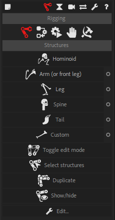

##  Structures

*To make the rigging process easier and more versatile in After Effects, we’ve introduced the Structures which are very similar to bones or joints in 3D software.*

***Structures*** are layers you can add in your composition which will drive the animations, like the rig of a real puppet. The process is very simple: **create or import your design** in After Effects, **add _Structures_** and move them to the right spots (the pivots of each limb). Then you can **rig those _Structures_**, instead of the design itself like in previous versions of Duik, and finally **parent the design layers to the corresponding Structure layers**.

This way, **the rig you create is independant from the design**. This means it’s easier to adjust the design even after the rig has been made, or even to re-use the same rig with other designs. Also, this rigging process is easier to fix or change if ever you need to adjust it even when you’re already in the process of animation.

*To get started quickly with this process, just watch this [jumpstart](https://www.youtube.com/watch?v=i63vPXJ00r0) by [Jake In Motion](https://www.jakeinmotion.com/):*  

As *Structures* will become so much important in the rigging process, we’ve thought about the smartest and quickest way to create them, so we added the ability to automatically create predefined Structures for standard limbs, whether they’re for humans or animals.

## Panel

  
This is the *Structures* panel as shown in the *Standard* mode.
