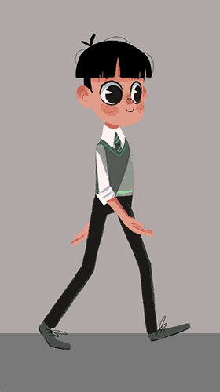
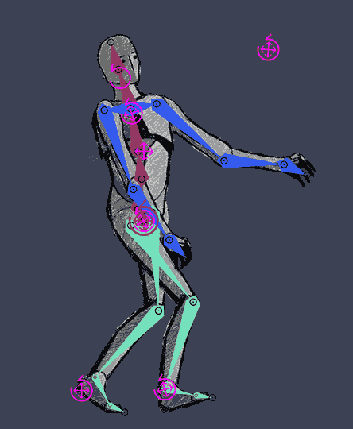
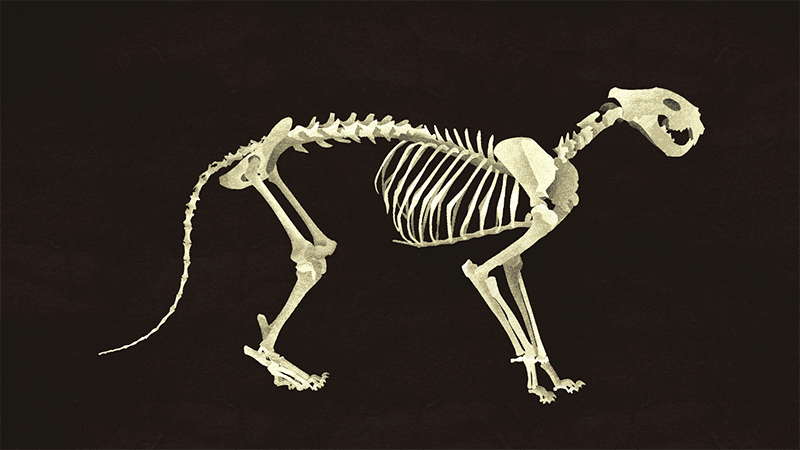
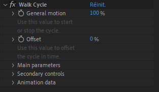
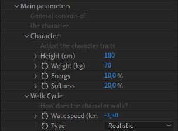
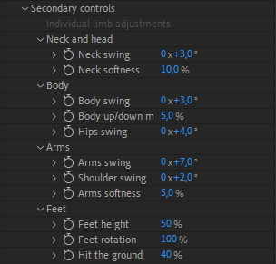
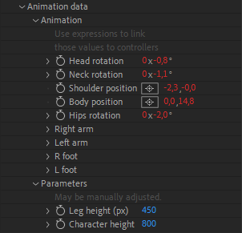
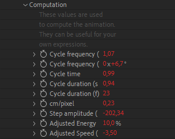

[TOC]

#  Walk Cycle

  
*Design by [Justine Cunha](https://www.artstation.com/jusdraw), animated by [Duduf](http://duduf.com)*

The ***Walk Cycle*** is the first comprehensive procedural animation available in Duik Bassel.

It’s a very quick and simple way to get started with walk animations. A nice walk cycle is just a click away, but you can go into details and adjust the character height and weight, but also every individual limb parameter and precisely set how it walks…

To use the *Walk cycle*, you must have a rigged character.

!!! hint
    In the Structures panel, `Alt + Click` on the *Hominoid* button will create a complete biped with a demo walk cycle.

!!! hint
    This walk cycle was made for bipeds, but you can achieve a quadruped walkcycle using two walk cycles: one for the front legs, shoulders, neck and head, and another one for the back legs and hips. You only have to animate the tail by yourself.

**To get started quickly with this process, [just watch this jumpstart by Jake In Motion](https://www.youtube.com/watch?v=i63vPXJ00r0)!**

## Setup

Before creating the walk cycle, make sure the character is standing straight, with the arms along the body, in a natural pose.
You will still be able to move the controllers after the walk cycle has been created to adjust the pose and the look of the walk, or even animate them above the automatic animation to adjust it.
The walk cycle is not meant to create perfect and characterized animation. It is a tool useful to get started quickly with walk animations which would need some tweaks to characterize them, or to animate quickly secondary, less important, characters.

If the character was rigged by predefined limb *Structures* and the *Auto-rig* of Duik, using the *Walk Cycle* is pretty straightforward:

1. Select all the controllers of the character
2. Click on the *Walk Cycle* button

If the character was rigged using *custom Structures* in Duik, or any other tool (*Rubberhose*, *BAO Bones*...) or even custom expressions, you can also use the *Walk Cycle*, but you will have to make some easy connections:

1. Select all the controllers of the character (the layers used to animate it, or which contain the effects needed to animate it)
2. Open the additionnal panel for the *Walk Cycle*
3. Assign the layers to their corresponding limbs. The eyedropper will set the currently selected layer in the composition.
4. a. Click on the *Create* button  
    b. Duik will try to link the properties of the controllers to the walk cycle, but if you are using custom rigs, it may not find them all, in this case, read the effect description below to see how you can connect them manually.

The *Walk Cycle* can be adjusted in the effects of the walk cycle controller which has been created in the composition.

!!! tip
    All controllers can still be animated, so you can add your own keyframes to adjust the animation to your taste or animate anything else. Feel free to move the controllers to adjust the pose of the character.

!!! caution
    The procedural walk cycle animates the arms with *Forward Kinematics (FK)* and thus deactivates the *Inverse Kinematics (IK)*. The position of the controllers of the armes do not influence the rig anymore, as the animation is made on the angles of the individual FK controls.

    If you want to animate or adjust the arms, you can either adjust the values in the *Individual FK controls* in the effects of the controllers, or you can enable again the IK, but this will deactivate the procedural animation on the arms.
    
!!! tip
    Duik tries to auto-detect which arm is the left arm and which is the right arm, but depending on the design, this detection may fail. In this case, both arms will swing synchroneously.
    You can fix this in the effects of the controllers for the arms, where you will find a *Side* property to change the side of the arm.

!!! hint
    You can animate the switch between IK and FK, and Duik provides a tool to ease this [*IK/FK switch*](ik-fk-switch.md) process.

    

!!! hint
    Even if it's not by design, you can use the walk cycle to animate quadrupeds... Just use it separately on the back legs and front legs as if they were two separate characters!

## Effect

- The *General motion* value can be used to start and stop the walk cycle. You can then animate the character as you would without the walk cycle tool to continue the animation before or after the walk.

- The *Main parameters* set the general information needed by the walk cycle to animate it correctly

- The *Secondary controls* are used to tweak each individual limb motion

- The *Animation data* is where you can connect custom controllers to the walk cycle, get data to use in your own expressions and rigs, and adjust some parameters needed for the computation.

### Main Parameters

All parameters use the metric system for now. Future versions of Duik will let you choose between the metric system and imperial units.

- *Character*: sets the main traits of the character.

    - Its *Height* influences the frequency of the cycle (the apparent speed of the feet).
    - Its *Weight* mainly influences the accelerations and decelerations of the motion (the momentum).
    - The *Energy* controls the amplitude of the movements.
    - The *Softness* controls how the muscles are contracted or not.

- *Walk Cycle*: sets the characteristics of the walk.

    - The walk speed adjusts the speed of the character. This parameters changes the amplitude of the steps - it does not change the frequency of the cycle which depends on the height of the character.- To change the direction of the cycle, change the sign of the speed.
    - You can choose between to walk cycle types: *Realistic* is the most natural, and *Dancing* adds a "double bounce" like Mickey Mouse.

### Secondary controls

Here you can adjust how each individual limb moves. In this version of Duik, you can not control separately the left and the right, but if you need to differenciate each side, you can create two different versions of the walk cycle in the same composition, one for each side.

You can adjust the swinging amplitude of the limbs, their softness (how the muscles are contracted), etc. Do not hesitate to test each control individually to see how it affects the walk cycle.

### Animation data

In this section you can adjust how the walk cycle is computed, connect your custom rig and controllers which Duik could not connect automatically, or get useful data for your own rigs and expressions.

#### Animation

This is where you can connect the properties of custom rigs and controllers. Each value in this section outputs the animation of the corresponding property on each limb. To connect the properties of your controllers, use the expression pickwhip to pick the corresponding animation property, and add `+ value;` at the end of the resulting expression.
The arms animation uses FK, you need to connect them to angle properties.
The feet animation uses IK, connect them to position properties.

#### Parameters

Duik tries to set some important parameters automatically when you create the walk cycle with some controllers selected, but if you are using a custom rig or if you connect controllers later, these properties may not be set properly. You can adjust them in this section.

- Duik needs to know the height of the legs of the character as displayed in the composition, in pixels, from the heel to the hips, when the character is standing.

- Duik also needs the height of the whole characer, in pixels, from the heel to the top of the head.

#### Computation

This section outputs some values used by Duik to compute the walk cycle. You can use them in your own expressions and rigs.

One value is especially useful: the *Cycle duration*, which is available in seconds or frames. To render perfect loops, you can set the work area or the composition duration to this value.
